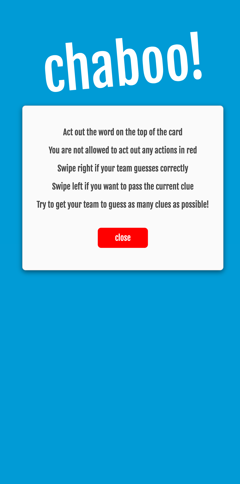
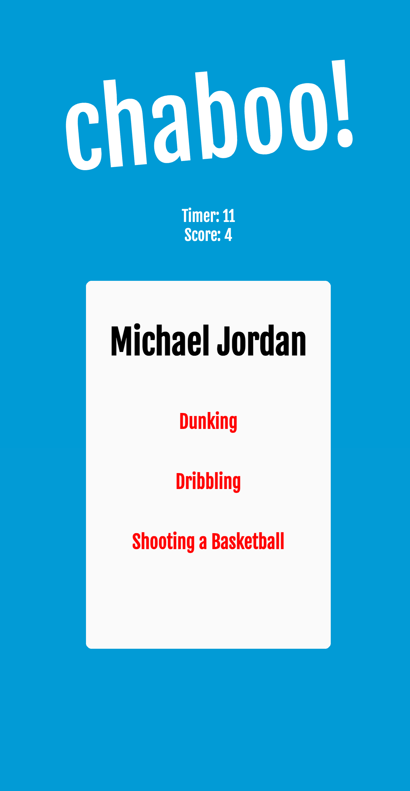

# Chaboo
Chaboo is a game of Charades with TABOO movements!
Each card will show a clue you will need to act out, with certain actions that you aren't allowed to act out. Be creative and try to get your team to guess the clue!
If your team guesses the correct answer, swipe to the right! If the clue is too difficult to act out, swipe left to skip.

Play on the web over Zoom or with the mobile-optimized web app!

Potential Future Features:
- Cards: More clues to act out!
- Options: Set time limit
- Categories: Select a category of clues
- Mobile App: Fully downloadable app
- Monitor Mode: Having opposing player in the same lobby to monitor taboo actions

https://github.com/andrewmdai/Chaboo/assets/126610812/6d582cbd-60fa-4317-b954-4530ddeefc9b

